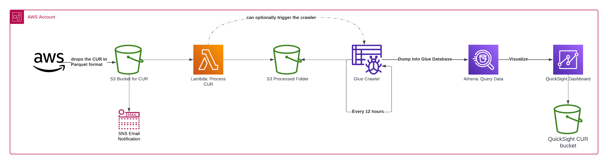

# Current Usage Report Processor

## Architecture

1. AWS drops the CUR report in a specific S3 Bucket in Parquet format
2. AWS Lambda will process the report for the givin data and store it in /processed folder
3. AWS Glue Crawler will run every 12 hours
4. Create Glue Database that can be queried by Athena on 125 columns from the CUR report
5. Visualize the data via Quicksight dashboard 

The `cdk.json` file tells the CDK Toolkit how to execute your app.

## Useful commands

* `npm run build`   compile typescript to js
* `npm run watch`   watch for changes and compile
* `npm run test`    perform the jest unit tests
* `npx cdk deploy`  deploy this stack to your default AWS account/region
* `npx cdk diff`    compare deployed stack with current state
* `npx cdk synth`   emits the synthesized CloudFormation template
