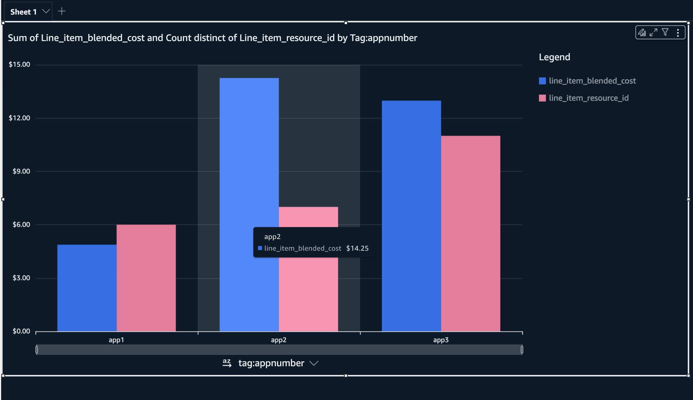
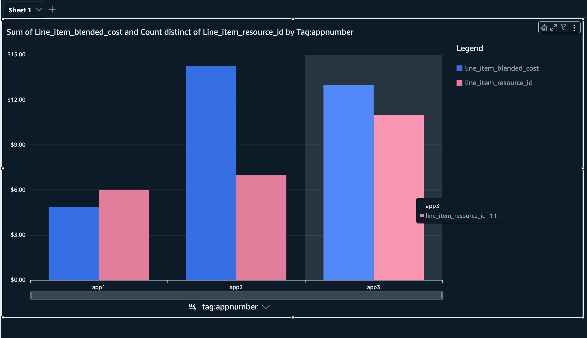

# AWS Dashboards and Data Processing




## Overview

This document provides insights into the process of preparing your AWS Cost and Usage Report (CUR) data and creating an analytics dashboard using Amazon Athena and Python with the Polars library.

## Python Data Processing

### Initial Setup and Data Loading

1. **Setup Sessions with Boto3 and Polars Configuration**:
    ```python
    import boto3 
    session = boto3.Session()
    sts_client = session.client('sts')
    identity = sts_client.get_caller_identity()
    import polars as pl
    from polars import col
    from itables import init_notebook_mode
    
    pl.Config.set_tbl_rows(25)
    pl.Config.set_fmt_str_lengths(255)
    
    init_notebook_mode(all_interactive=False)
    ```

2. **Load CUR Data into Polars DataFrame**:
    ```python
    df = pl.read_parquet('./hearst-sandbox-dec-cur.snappy.parquet')
    ```

### Processing Data

- **Extract, Validate, and Manipulate ARNs**:
    Functions were created to extract, handle, and validate resource IDs and ARNs, ensuring correct transformation between different AWS service identifiers.

- **Filtering and Transformation**:
    Retrieve resources with non-null identifiers and create unique identifiers for processing resource usage and costs.

    ```python
    not_null_resources_df = df.filter(pl.col('line_item_resource_id').is_not_null() & pl.col('product_region_code').is_not_null())
    unique_resources_df = not_null_resources_df.select([... specific columns for TCO calculations ...])
    ```

- **Normalizing Resource ARNs**:
    Code to reconstruct ARNs for non-standard resource IDs by applying logical checks on product codes and appending valid ARN structures.

### Creating Tag-Rich Data for Visualization

- **Resource-Tag Mapping Across Regions**:
    Fetch AWS resource tags using the boto3 `resourcegroupstaggingapi` client. Loop through all regions, collect resource tags, and store them in a DataFrame.

    ```python
    triplets_dict = {"ResourceARN": [], "TagKey": [], "TagValue": []}
    regions = [...]  # List of AWS regions

    for r in regions:
        client = boto3.client('resourcegroupstaggingapi', region_name=r)
        paginator = client.get_paginator('get_resources')
        response_iterator = paginator.paginate()

        for response in response_iterator:
            for resource in response["ResourceTagMappingList"]:
                for tag in resource["Tags"]:
                    if all([resource["ResourceARN"], tag["Key"], tag["Value"]]):
                        triplets_dict["ResourceARN"].append(resource["ResourceARN"])
                        triplets_dict["TagKey"].append(tag["Key"])
                        triplets_dict["TagValue"].append(tag["Value"])

    triplets_df = pl.DataFrame(triplets_dict)
    triplets_df.write_parquet('./tag-data.snappy.parquet', compression='snappy')
    ```

### Exporting Data

- **Export Processed Data to Parquet**:
    Store processed DataFrames into `.snappy.parquet` files for efficient access and querying through Athena.

    ```python
    unique_resources_df.write_parquet('./non-null-resources.snappy.parquet', compression='snappy')
    ```

## Athena Queries

### Database and Table Setup

- **Creation of External Tables in Athena**:
    SQL scripts were generated to create external tables in Athena using Parquet data stored in S3 buckets.

    ```sql
    CREATE EXTERNAL TABLE IF NOT EXISTS non_null_resources_db.non_null_resources_table (
      line_item_resource_id STRING,
      ...
    )
    STORED AS PARQUET
    LOCATION 's3://curprocessorstack-curbucket1acad2a6-josrlebznwwi/quicksight/non-null-resources/';

    CREATE EXTERNAL TABLE IF NOT EXISTS modified_unique_resources_db.modified_unique_resources_table (
      line_item_resource_id STRING,
      ...
    )
    STORED AS PARQUET
    LOCATION 's3://curprocessorstack-curbucket1acad2a6-josrlebznwwi/quicksight/modified-unique-resources/';

    CREATE EXTERNAL TABLE IF NOT EXISTS tag_data_db.tag_data_table (
      ResourceARN STRING,
      TagKey STRING,
      TagValue STRING
    )
    STORED AS PARQUET
    LOCATION 's3://curprocessorstack-curbucket1acad2a6-josrlebznwwi/quicksight/tag-data/';
    ```

### Query Execution for Insights

- **Aggregation and Joining**:
    SQL for joining tables and preparing the `app_cost_table` for visualization needs.

    ```sql
    CREATE TABLE app_cost_table WITH (
      external_location = 's3://curprocessorstack-curbucket1acad2a6-josrlebznwwi/quicksight/app_cost_table/',
      format = 'PARQUET',
      parquet_compression = 'SNAPPY'
    ) AS
    SELECT 
        murt.line_item_resource_id,
        murt.line_item_product_code,
        murt.product_region_code,
        murt.line_item_usage_account_id,
        murt.resource_tags,
        murt.line_item_blended_cost,
        ...
        COALESCE(td.TagValue, NULL) AS "tag:appNumber"
    FROM 
        modified_unique_resources_db.modified_unique_resources_table murt
    LEFT JOIN
        tag_data_db.tag_data_table td
    ON 
        murt.line_item_resource_id = td.ResourceARN
        AND td.TagKey = 'appNumber'
    ORDER BY 
        "tag:appNumber";
    ```

### Visualization and Analysis

- **QuickSight Analysis**:
    Create visualizations in QuickSight utilizing the Athena tables to design dashboards.

---

### Notes:
- **Performance Considerations**: Ensure datasets are optimized with correct serialization using Parquet for efficiency.
- **Security and Access**: Verify system access policies for all tools (Athena, S3, QuickSight) to ensure data integrity and compliance.

This README serves as a comprehensive guide covering the entire lifecycle of your data process from extraction to visualization with thorough documentation for future maintenance and enhancements.